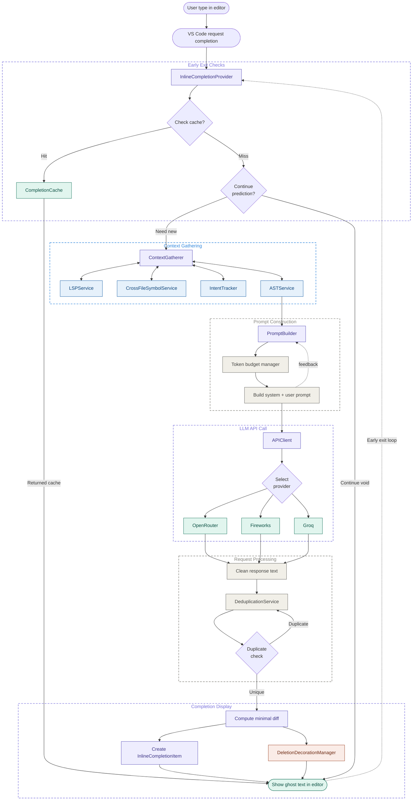

```mermaid
flowchart TD
    A([User type in editor]) --> B([VS Code request completion])
    B --> C

    subgraph EarlyExit["Early Exit Checks"]
        C[InlineCompletionProvider]
        C --> D{Check cache?}
        D -->|Hit| E[CompletionCache]
        D -->|Miss| F{Continue\nprediction?}
    end

    subgraph ContextGathering["Context Gathering"]
        G[ContextGatherer]
        G <--> H[LSPService]
        G <--> I[CrossFileSymbolService]
        G <--> J[IntentTracker]
        G <--> K[ASTService]
    end

    subgraph PromptConstruction["Prompt Construction"]
        L[PromptBuilder]
        L --> M[Token budget manager]
        M --> N[Build system + user prompt]
        N -.->|feedback| L
    end

    subgraph LLMAPICall["LLM API Call"]
        O[APIClient]
        O --> P{Select\nprovider}
        P --> Q[OpenRouter]
        P --> R[Fireworks]
        P --> S[Groq]
    end

    subgraph RequestProcessing["Request Processing"]
        T[Clean response text]
        T --> U[DeduplicationService]
        U --> V{Duplicate\ncheck}
        V -->|Duplicate| U
    end

    subgraph CompletionDisplay["Completion Display"]
        W[Compute minimal diff]
        W --> X[Create InlineCompletionItem]
        W --> Y[DeletionDecorationManager]
        X --> Z([Show ghost text in editor])
        Y --> Z
    end

    F -->|Need new| G
    K --> L
    N --> O
    Q --> T
    R --> T
    S --> T
    V -->|Unique| W

    E -->|Returned cache| Z
    F -->|Continue void| Z
    Z -.->|Early exit loop| C

    style EarlyExit        fill:transparent,stroke:#7F77DD,stroke-width:1.5px,stroke-dasharray:6 4,color:#7F77DD
    style ContextGathering fill:transparent,stroke:#378ADD,stroke-width:1.5px,stroke-dasharray:6 4,color:#378ADD
    style PromptConstruction fill:transparent,stroke:#888780,stroke-width:1.5px,stroke-dasharray:6 4,color:#888780
    style LLMAPICall       fill:transparent,stroke:#7F77DD,stroke-width:1.5px,stroke-dasharray:6 4,color:#7F77DD
    style RequestProcessing fill:transparent,stroke:#888780,stroke-width:1.5px,stroke-dasharray:6 4,color:#888780
    style CompletionDisplay fill:transparent,stroke:#7F77DD,stroke-width:1.5px,stroke-dasharray:6 4,color:#7F77DD

    style C fill:#EEEDFE,stroke:#534AB7,color:#3C3489
    style E fill:#E1F5EE,stroke:#0F6E56,color:#085041
    style G fill:#EEEDFE,stroke:#534AB7,color:#3C3489
    style H fill:#E6F1FB,stroke:#185FA5,color:#0C447C
    style I fill:#E6F1FB,stroke:#185FA5,color:#0C447C
    style J fill:#E6F1FB,stroke:#185FA5,color:#0C447C
    style K fill:#E6F1FB,stroke:#185FA5,color:#0C447C
    style L fill:#EEEDFE,stroke:#534AB7,color:#3C3489
    style M fill:#F1EFE8,stroke:#5F5E5A,color:#444441
    style N fill:#F1EFE8,stroke:#5F5E5A,color:#444441
    style O fill:#EEEDFE,stroke:#534AB7,color:#3C3489
    style Q fill:#E1F5EE,stroke:#0F6E56,color:#085041
    style R fill:#E1F5EE,stroke:#0F6E56,color:#085041
    style S fill:#E1F5EE,stroke:#0F6E56,color:#085041
    style T fill:#F1EFE8,stroke:#5F5E5A,color:#444441
    style U fill:#F1EFE8,stroke:#5F5E5A,color:#444441
    style W fill:#EEEDFE,stroke:#534AB7,color:#3C3489
    style X fill:#EEEDFE,stroke:#534AB7,color:#3C3489
    style Y fill:#FAECE7,stroke:#993C1D,color:#712B13
    style Z fill:#E1F5EE,stroke:#0F6E56,color:#085041
```
