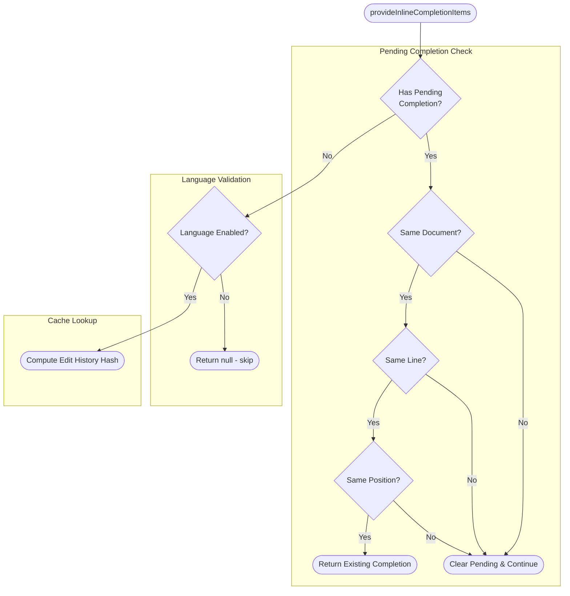

```mermaid
flowchart TD
    A([provideInlineCompletionItems]) --> B{Has Pending\nCompletion?}

    subgraph pending["Pending Completion Check"]
        B -->|Yes| C{Same Document?}
        C -->|Yes| D{Same Line?}
        D -->|Yes| E{Same Position?}
        E -->|Yes| F([Return Existing Completion])
        E -->|No| G([Clear Pending & Continue])
        D -->|No| G
        C -->|No| G
    end

    B -->|No| H

    subgraph lang["Language Validation"]
        H{Language Enabled?}
        H -->|No| I([Return null - skip])
    end

    H -->|Yes| J

    subgraph cache["Cache Lookup"]
        J([Compute Edit History Hash])
    end
```
