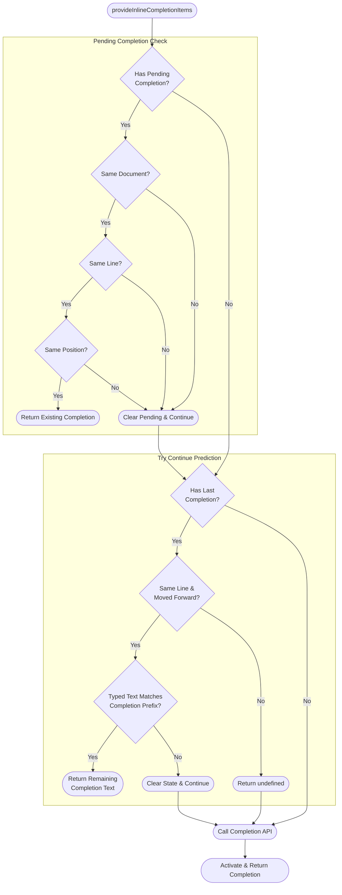

```mermaid
flowchart TD
    A([provideInlineCompletionItems]) --> B{Has Pending\nCompletion?}

    subgraph pending["Pending Completion Check"]
        B -->|Yes| C{Same Document?}
        C -->|Yes| D{Same Line?}
        D -->|Yes| E{Same Position?}
        E -->|Yes| F([Return Existing Completion])
        E -->|No| G([Clear Pending & Continue])
        D -->|No| G
        C -->|No| G
    end

    B -->|No| H
    G --> H

    subgraph predict["Try Continue Prediction"]
        H{Has Last\nCompletion?}
        H -->|Yes| I{Same Line &\nMoved Forward?}
        I -->|Yes| J{Typed Text Matches\nCompletion Prefix?}
        J -->|Yes| K([Return Remaining\nCompletion Text])
        J -->|No| L([Clear State & Continue])
        I -->|No| M([Return undefined])
    end

    H -->|No| N
    L --> N
    M --> N

    N([Call Completion API]) --> O([Activate & Return Completion])
```
