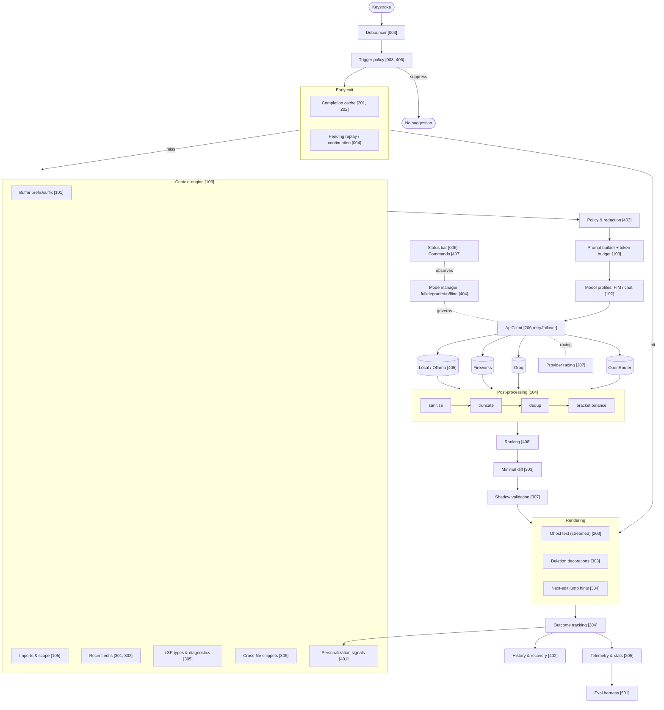
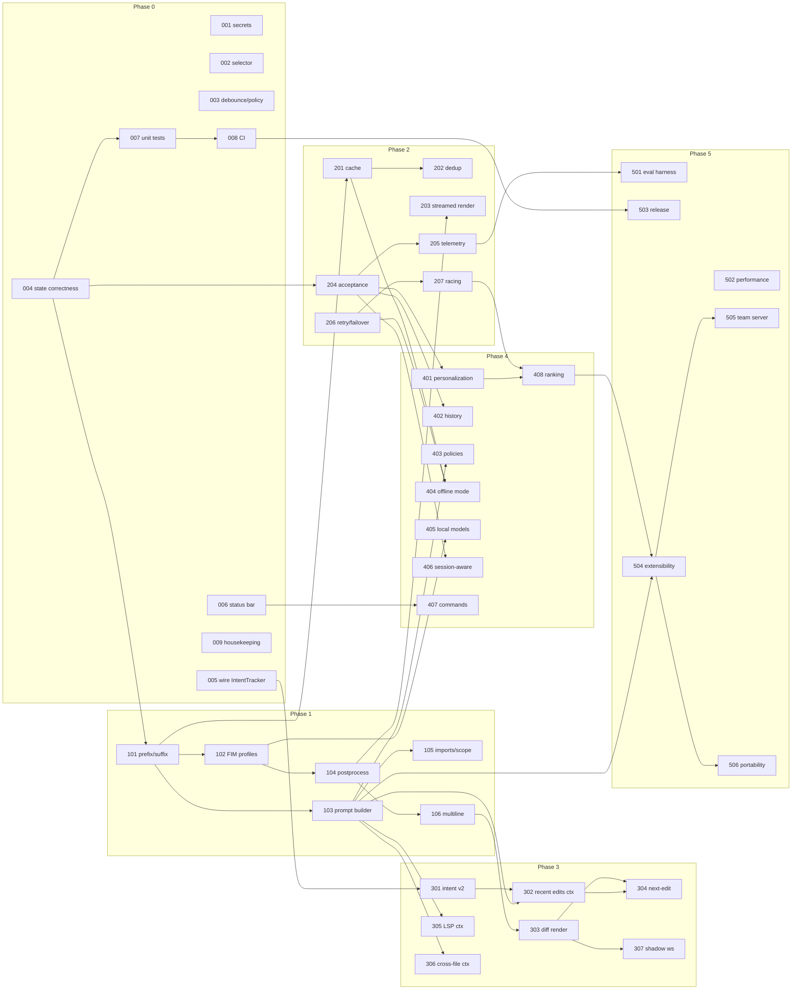

# Deeptab Roadmap — Issue Backlog

Every file in this folder is a self-contained, GitHub-issue-ready work item. Together they form the complete path from the current prototype to a production-ready, market-competitive tab completion extension.

## How to use (solo workflow)

1. Work phases in order. Inside a phase, respect `Depends on`; otherwise pick freely.
2. When you start an item, raise it as a GitHub issue (copy the file body, or `gh issue create --title "..." --body-file roadmap/phase-0/001-secret-storage.md --label phase-0`).
3. Close the issue only when every acceptance criterion passes.
4. Fine-tune freely — split items that feel too big, merge ones that feel too small. Keep this index in sync.

## Issue format

Each file: header table (priority, estimate, dependencies) → **Problem** → **Tasks** → **Acceptance criteria** → **Out of scope** → **Code references**.

Estimates: `S` = ≤1 day, `M` = 2–4 days, `L` = ~1 week, `XL` = 2+ weeks (consider splitting).

## Phase overview

| Phase | Theme | Exit criteria |
|---|---|---|
| [0](#phase-0--hardening) | Correctness, safety, measurability of existing loop | No known state-machine bugs; no plaintext keys; tests + CI green |
| [1](#phase-1--context-engine--fim) | Real context + FIM prompting — the quality jump | Suggestions reflect surrounding code; FIM path live |
| [2](#phase-2--speed-caching-feedback) | Feel instant; measure everything | p50 first-char < 250 ms; cache hit & acceptance rate visible |
| [3](#phase-3--edit-aware-intelligence) | Predict the edit, not just the cursor | Repeated-edit prediction works; bad multi-line edits filtered |
| [4](#phase-4--personalization-policies-resilience) | Adapt to user; survive failure | Offline mode; policies; local models; ranking |
| [5](#phase-5--production--ecosystem) | Ship and scale | Marketplace release pipeline; eval-gated changes |

## Target architecture

Where the roadmap converges. Each block maps to issues (numbers in brackets). Planned files are referenced throughout the issues even though they don't exist yet — they define the destination structure.

## Dependency graph

Critical path runs left to right; anything not on an arrow can be picked up independently once its phase opens.

## Phase 0 — Hardening

| # | Issue | Priority | Est | Depends on |
|---|---|---|---|---|
| 001 | [Migrate API keys to SecretStorage](phase-0/001-secret-storage.md) | P0 | M | — |
| 002 | [Document selector + language enable/disable](phase-0/002-document-selector-language-settings.md) | P0 | S | — |
| 003 | [Debounce + trigger policy v1](phase-0/003-debounce-trigger-policy.md) | P0 | M | — |
| 004 | [Version-aware completion state + honor temperature](phase-0/004-state-correctness.md) | P0 | M | — |
| 005 | [Wire IntentTracker into composition root](phase-0/005-wire-intent-tracker.md) | P1 | S | — |
| 006 | [Status bar item](phase-0/006-status-bar.md) | P1 | S | — |
| 007 | [Unit tests for pure logic](phase-0/007-unit-tests-pure-logic.md) | P0 | M | 004 |
| 008 | [CI pipeline](phase-0/008-ci-pipeline.md) | P0 | S | 007 |
| 009 | [Housekeeping: license, artifacts, .env](phase-0/009-housekeeping.md) | P1 | S | — |

## Phase 1 — Context engine & FIM

| # | Issue | Priority | Est | Depends on |
|---|---|---|---|---|
| 101 | [Prefix/suffix window context](phase-1/101-prefix-suffix-context.md) | P0 | M | 004 |
| 102 | [Model profiles + FIM prompting](phase-1/102-model-profiles-fim.md) | P0 | L | 101 |
| 103 | [Prompt builder + token budget manager](phase-1/103-prompt-builder-token-budget.md) | P0 | M | 101 |
| 104 | [Post-processing v1](phase-1/104-postprocessing-v1.md) | P0 | M | 102 |
| 105 | [Imports & enclosing-scope context](phase-1/105-imports-siblings-context.md) | P1 | M | 103 |
| 106 | [Multi-line completions](phase-1/106-multiline-completions.md) | P1 | M | 104 |

## Phase 2 — Speed, caching, feedback

| # | Issue | Priority | Est | Depends on |
|---|---|---|---|---|
| 201 | [Completion cache](phase-2/201-completion-cache.md) | P0 | L | 101 |
| 202 | [Request dedup / single-flight](phase-2/202-request-dedup.md) | P1 | S | 201 |
| 203 | [Streamed first-line render](phase-2/203-streamed-render.md) | P1 | M | 104 |
| 204 | [Acceptance tracking](phase-2/204-acceptance-tracking.md) | P0 | M | 004 |
| 205 | [Local telemetry & stats](phase-2/205-local-telemetry.md) | P0 | M | 204 |
| 206 | [Retry / failover / circuit breaker](phase-2/206-retry-failover.md) | P0 | M | — |
| 207 | [Provider racing (fast-first-token)](phase-2/207-provider-racing.md) | P2 | M | 206 |

## Phase 3 — Edit-aware intelligence

| # | Issue | Priority | Est | Depends on |
|---|---|---|---|---|
| 301 | [IntentTracker v2: finalized intents + edit history](phase-3/301-intent-tracker-v2.md) | P0 | L | 005 |
| 302 | [Recent-edits context source](phase-3/302-recent-edits-context.md) | P0 | M | 301, 103 |
| 303 | [Replacement & deletion rendering](phase-3/303-diff-rendering.md) | P0 | L | 106 |
| 304 | [Next-edit prediction v1](phase-3/304-next-edit-prediction.md) | P1 | XL | 302, 303 |
| 305 | [LSP context source](phase-3/305-lsp-context.md) | P1 | M | 103 |
| 306 | [Cross-file context v1](phase-3/306-cross-file-context.md) | P1 | L | 103 |
| 307 | [Shadow workspace validation](phase-3/307-shadow-workspace.md) | P2 | L | 303 |

## Phase 4 — Personalization, policies, resilience

| # | Issue | Priority | Est | Depends on |
|---|---|---|---|---|
| 401 | [Personalized completion memory](phase-4/401-personalized-memory.md) | P1 | L | 204 |
| 402 | [Completion history & recovery](phase-4/402-completion-history.md) | P2 | M | 204 |
| 403 | [Custom completion policies](phase-4/403-custom-policies.md) | P1 | M | 103 |
| 404 | [Offline / degraded mode](phase-4/404-offline-degraded-mode.md) | P1 | M | 201, 206 |
| 405 | [Local model support (Ollama / llama.cpp)](phase-4/405-local-models.md) | P1 | M | 102 |
| 406 | [Session-aware trigger behavior](phase-4/406-session-aware-behavior.md) | P2 | M | 204 |
| 407 | [Command palette & quick actions](phase-4/407-commands-quick-actions.md) | P1 | S | 006 |
| 408 | [Multi-source suggestion ranking](phase-4/408-multi-source-ranking.md) | P2 | L | 207, 401 |

## Phase 5 — Production & ecosystem

| # | Issue | Priority | Est | Depends on |
|---|---|---|---|---|
| 501 | [Evaluation harness](phase-5/501-eval-harness.md) | P0 | XL | 205 |
| 502 | [Performance: bundling, lazy activation, memory caps](phase-5/502-performance-engineering.md) | P0 | M | — |
| 503 | [Release engineering](phase-5/503-release-engineering.md) | P0 | M | 008 |
| 504 | [Extensibility API](phase-5/504-extensibility-api.md) | P1 | L | 103, 408 |
| 505 | [Team / server mode (exploratory)](phase-5/505-team-server-mode.md) | P3 | XL | 504 |
| 506 | [Editor portability (exploratory)](phase-5/506-editor-portability.md) | P3 | XL | 504 |

## Suggested labels

`phase-0` … `phase-5`, `P0`–`P3`, `area:context`, `area:provider`, `area:cache`, `area:ui`, `area:testing`, `area:security`, `exploratory`.
