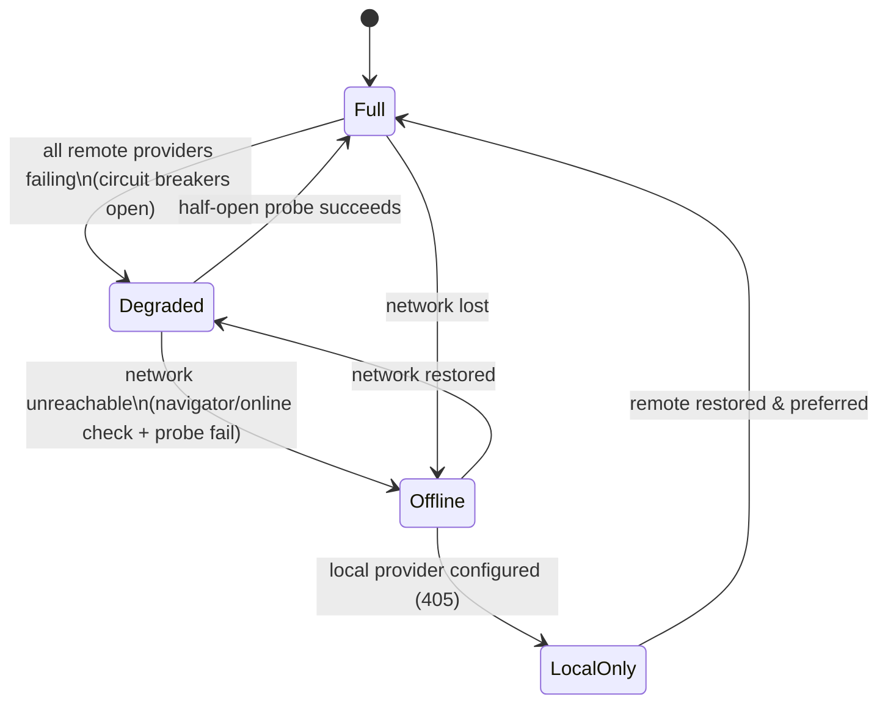

# Offline / degraded mode

| Priority | Estimate | Labels | Depends on |
|---|---|---|---|
| P1 | M | phase-4, area:provider | 201, 206 |

## Problem

No network, all providers rate-limited, or no keys configured → today the extension silently fails per-request with log noise. Needs an explicit mode state machine with graceful behavior and honest UI.

## Mode state machine

## Tasks

- [ ] Create `src/core/modeManager.ts` (to create) implementing the state machine; inputs: circuit-breaker states (206), lightweight connectivity probe (only when breakers suggest network issue — no polling when healthy).
- [ ] Behavior per mode:
  - **Full**: normal pipeline
  - **Degraded**: cache (201) + continuation/replay only; no new API calls; suppression logged once, not per keystroke
  - **Offline**: same as degraded + skip probes except on editor focus/interval backoff
  - **LocalOnly**: route to local provider (405) when configured
- [ ] Status bar (006) shows mode with tooltip explaining why + what still works.
- [ ] Zero notification spam: one transition notification max, only on Full→worse transitions.
- [ ] Manual override command: `Deeptab: Force Offline Mode` (privacy use case: guarantee nothing leaves the machine this session).
- [ ] Tests: transition matrix with mocked breaker/connectivity inputs.

## Acceptance criteria

- Disable network mid-session: status flips to Offline within seconds; cached/continuation completions still serve; output channel shows no error storm.
- Restore network: auto-recovery to Full without reload.
- Force-offline command verifiably prevents all outbound requests.

## Out of scope

- Local model integration itself (405).
