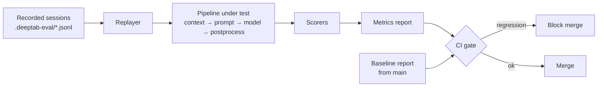

# Evaluation harness

| Priority | Estimate | Labels | Depends on |
|---|---|---|---|
| P0 | XL | phase-5, area:testing | 205 |

## Problem

Prompt, context, and ranking changes currently ship on vibes. A market-credible engine needs offline, repeatable measurement: replay recorded editing scenarios through the pipeline and score the suggestions. No quality-affecting change should merge without an eval run.

## Harness flow

## Tasks

- [ ] Recorder: dev-mode flag capturing anonymizable editing sessions — sequence of `{documentSnapshot, position, triggerKind, groundTruth: what the user actually typed next}`; store as JSONL fixtures. Build corpus from own dogfooding across ≥ 3 languages.
- [ ] Replayer (`eval/` directory, runs in Node without extension host — payoff of the pure-logic separation): feed each scenario through context gathering (buffer-level sources), prompt builder, model call, post-processing.
- [ ] Scorers:
  - exact/prefix match vs ground truth (chars matched before first divergence)
  - edit-distance similarity
  - syntactic validity rate
  - would-have-been-accepted proxy (prefix-match ≥ threshold)
  - latency + token cost per scenario
- [ ] Report: per-language/per-scenario-class breakdown; JSON + markdown output; baseline comparison (`--baseline main-report.json`) with regression thresholds.
- [ ] CI integration (008): manual-trigger or label-gated job (costs API tokens); cached model responses for deterministic re-scoring of post-processing/ranking changes without re-querying.
- [ ] Process rule documented in CONTRIBUTING: prompt/context/ranking PRs must attach an eval report.

## Acceptance criteria

- `npm run eval -- --scenarios eval/fixtures --model <m>` produces a scored report end to end.
- A deliberately degraded prompt (e.g. drop suffix context) shows a clear metric regression vs baseline.
- Post-processing changes re-scoreable from cached responses with zero API calls.

## Out of scope

- Online A/B testing; public benchmark publication (later).
