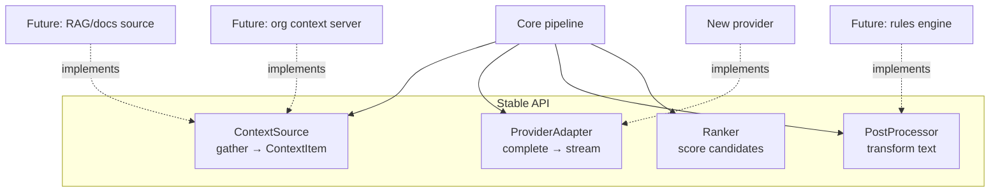

# Extensibility API: stable plugin points

| Priority | Estimate | Labels | Depends on |
|---|---|---|---|
| P1 | L | phase-5, area:context | 103, 408 |

## Problem

Future capability (org context servers, RAG over internal docs, rules engines, new providers, custom rankers) shouldn't require forking the pipeline. The interfaces already exist informally — `ContextSource` (103), provider adapters (405), post-processors (104), scorers (408); this issue hardens them into a stable, versioned internal API.

## Plugin surface

## Tasks

- [ ] Extract and freeze interfaces in `src/api/extensibility/` (to create): `ContextSource`, `ProviderAdapter`, `PostProcessor`, `Ranker` — versioned (`apiVersion`), documented with TSDoc, no `vscode` types in signatures (plain data in/out) so implementations stay testable and portable (506).
- [ ] Registry with ordering/priority + enable flags per registered component; core features re-registered through the same registry (dogfood the API — no privileged paths).
- [ ] Two consumption modes, decide and document:
  1. in-repo contributions (PR adds a source/provider) — definitely supported
  2. cross-extension API (`vscode.extensions.getExtension('…').exports`) exposing the registry — evaluate security implications (a malicious source sees prompts; a provider sees code) → if exposed, gate behind explicit user consent setting listing the extension IDs.
- [ ] Policy enforcement (403) wraps ALL sources/providers including external ones — redaction runs after every source, provider allowlist applies.
- [ ] Reference implementation as proof: rewrite one existing source (e.g. 105 fileStructureSource) purely against the public API.
- [ ] `docs/extensibility.md` (to create): how to add a source/provider/ranker, with the reference impl as tutorial.

## Acceptance criteria

- All built-in sources/providers/post-processors/rankers flow through the registry.
- A new context source can be added without touching pipeline code (demonstrated by reference impl PR).
- External-extension mode (if shipped) requires explicit consent and respects policies.

## Out of scope

- Marketplace ecosystem of plugins; sandboxing/process isolation (revisit with 505).
