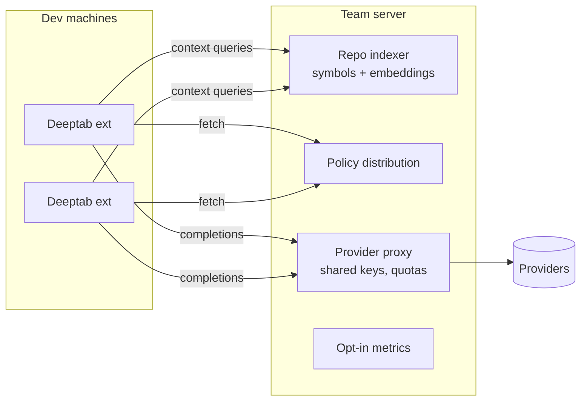

# Team / server mode (exploratory)

| Priority | Estimate | Labels | Depends on |
|---|---|---|---|
| P3 | XL | phase-5, exploratory | 504 |

## Problem

Teams duplicate work: every member's extension independently discovers the same repo structure, and org policies/keys are distributed by hand. A shared context server can index a repo once, serve rich cross-file/semantic context to all members, centralize policy and provider credentials, and aggregate (consented) quality metrics.

## Architecture sketch

## Tasks (spike-first)

- [ ] Design doc `docs/rfc/team-server.md` (to create): threat model (code leaves the laptop — auth, TLS, tenancy), deployment story (single binary / Docker), protocol (HTTP+JSON; consider LSP-style).
- [ ] Spike 1 — remote `ContextSource` via 504: extension queries server for symbol/semantic context; server runs tree-sitter + embedding index over the repo; measure quality lift vs local-only 306 using eval harness (501).
- [ ] Spike 2 — provider proxy: server holds provider keys; extension authenticates to server (device flow); per-user quotas + audit log.
- [ ] Policy distribution: server serves the 403 policy; client merges as most-restrictive.
- [ ] Go/no-go decision documented after spikes (value vs operational complexity for the target audience).

## Acceptance criteria (for the exploration)

- RFC reviewed/committed; both spikes runnable; eval-measured quality delta recorded.
- Explicit go/no-go with reasoning in the RFC.

## Out of scope

- Production hardening, billing, SSO — only if go.
