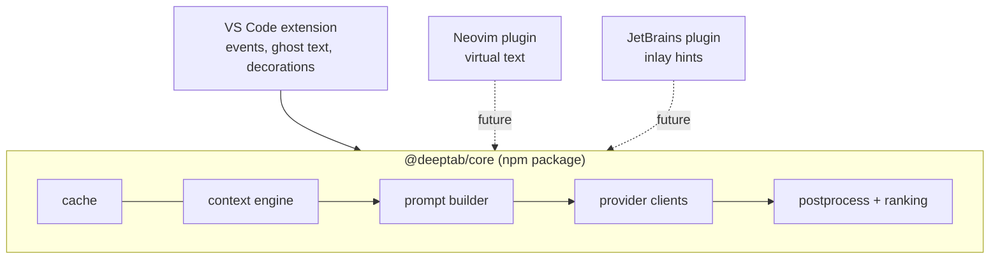

# Editor portability: extract core engine (exploratory)

| Priority | Estimate | Labels | Depends on |
|---|---|---|---|
| P3 | XL | phase-5, exploratory | 504 |

## Problem

Everything outside rendering and editor events — context assembly, prompting, providers, post-processing, ranking, caching — is editor-agnostic by design (pure modules, no `vscode` types in API signatures per 504). Extracting it into a standalone package opens Neovim/JetBrains frontends and is the structural proof that the architecture is actually clean.

## Target structure

## Tasks (spike-first)

- [ ] Define the editor abstraction `EditorHost` interface: document text/version access, position math, diagnostics query, secret storage, config — everything core currently gets from `vscode`.
- [ ] Monorepo split: `packages/core` (no `vscode` dependency, plain TS), `packages/vscode` (the extension, implements `EditorHost`); npm workspaces; CI builds both.
- [ ] Move pure modules first (postprocess, prompt, tokenBudget, ranking, cache, triggerPolicy decisions) — these already have no `vscode` imports if 007/103 were done right; the diff exposes any leakage.
- [ ] Provider clients: replace `vscode.OutputChannel` logging with injected logger interface; `fetch` is standard.
- [ ] Proof spike: minimal Neovim prototype (Lua + node host or stdio JSON-RPC to a core daemon) rendering one completion end to end. Throwaway code; the goal is validating the boundary.
- [ ] Decision doc: ship `@deeptab/core` publicly vs keep internal monorepo split only.

## Acceptance criteria (for the exploration)

- `packages/core` compiles and passes its test suite with zero `vscode` imports (enforced by lint rule).
- VS Code extension functionally unchanged after the split (full regression suite green).
- Neovim spike renders a real completion from the shared core.

## Out of scope

- Production Neovim/JetBrains plugins; core daemon performance work.
