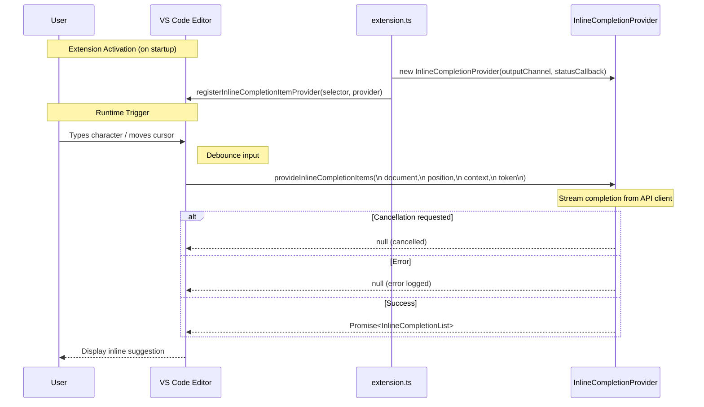

```mermaid
sequenceDiagram
    participant U as User
    participant VS as VS Code Editor
    participant EXT as extension.ts
    participant ICP as InlineCompletionProvider

    Note over U,VS: Extension Activation (on startup)

    EXT->>ICP: new InlineCompletionProvider(outputChannel, statusCallback)
    EXT->>VS: registerInlineCompletionItemProvider(selector, provider)

    Note over U,VS: Runtime Trigger

    U->>VS: Types character / moves cursor
    Note right of VS: Debounce input

    VS->>ICP: provideInlineCompletionItems(\n document,\n position,\n context,\n token\n)

    Note over ICP: Stream completion from API client
    alt Cancellation requested
        ICP-->>VS: null (cancelled)
    else Error
        ICP-->>VS: null (error logged)
    else Success
        ICP-->>VS: Promise<InlineCompletionList>
    end

    VS-->>U: Display inline suggestion
```
